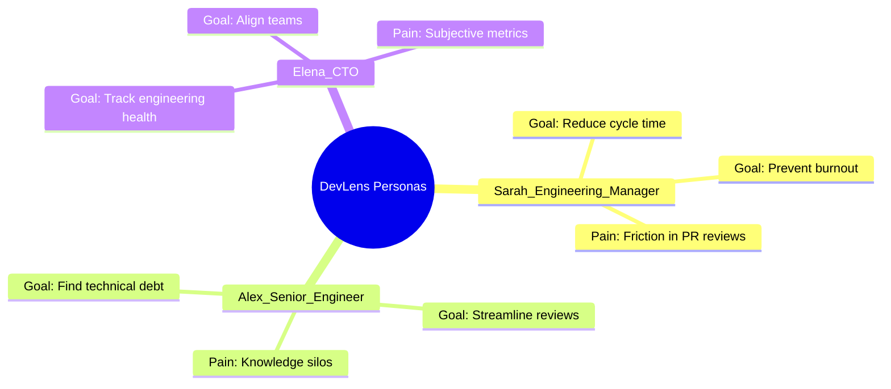
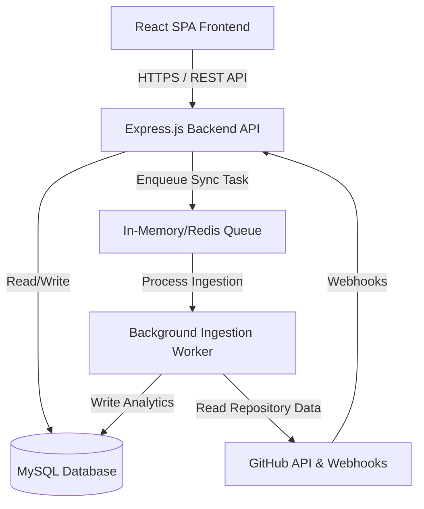
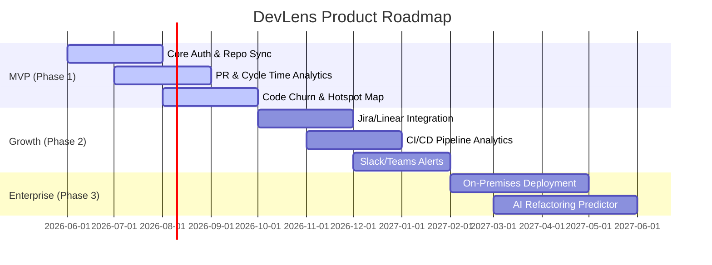

# Software Requirements Specification (SRS)
## Project: DevLens
**Version:** 1.0.0  
**Date:** June 26, 2026  
**Author:** Senior Product Manager & Lead Solution Architect  

---

## 1. Executive Summary & Problem Statement

### 1.1 Problem Statement
In modern software engineering, visibility into codebase health, workflow efficiency, and team collaboration is often fragmented and subjective. Engineering leaders and developers face several key challenges:
* **The Visibility Gap:** Engineering managers lack data-driven insights into team velocity, cycle times, and process bottlenecks. They rely on subjective stand-ups or high-level project management tools (like Jira or Linear) which do not reflect the actual state of the codebase.
* **Codebase Decay & Technical Debt:** Codebases naturally accumulate technical debt. Complex, high-churn files ("hotspots") are rarely identified systematically until they cause critical production outages or severe development slowdowns.
* **Pull Request (PR) Bottlenecks:** Pull requests frequently languish in review queues, increasing cycle times and stalling features. Identifying why PRs are blocked (e.g., size, reviewer availability, lack of clarity) is currently a manual, tedious process.
* **Collaboration Silos:** Without a clear view of code co-authorship and review patterns, teams risk developing knowledge silos where single individuals become single points of failure for critical modules.
* **Invasive Monitoring Concerns:** Existing developer metrics tools often focus on individual lines of code (LOC) or commit counts, creating a culture of micromanagement and anxiety rather than focusing on team enablement and process health.

### 1.2 The DevLens Vision
DevLens is a comprehensive, non-invasive engineering intelligence platform. By connecting directly to version control systems (VCS) via APIs, DevLens analyzes repository metadata, commit patterns, pull request workflows, and code complexity. It translates raw Git data into intuitive, actionable "lenses" that help teams:
1. Streamline their review processes and reduce cycle times.
2. Proactively manage technical debt by highlighting high-risk, high-churn files.
3. Foster healthy collaboration and eliminate knowledge silos.
4. Improve team delivery predictability through objective metrics.

---

## 2. Project Goals & Scope

### 2.1 Strategic Goals
* **Improve Engineering Velocity:** Reduce average Pull Request cycle time by identifying workflow friction and review latency.
* **Enhance Code Quality & Maintainability:** Identify code hotspots (files with high complexity and frequent modifications) to guide refactoring efforts.
* **Promote Collaborative Culture:** Enable transparent code reviews, balanced review workloads, and cross-component familiarity.
* **Protect Developer Autonomy:** Focus metrics on team processes and system dynamics rather than individual micro-performance.

### 2.2 Technical Goals
* **Seamless Integrations:** Provide a zero-configuration integration with GitHub via OAuth and Webhooks.
* **Near Real-Time Synchronization:** Ensure repository events (commits, PRs, reviews) are ingested and analyzed within minutes.
* **High-Performance Dashboards:** Deliver a highly responsive React frontend with interactive data visualizations loading in under 1 second.
* **Scalable Data Processing:** Design an asynchronous background worker system capable of parsing large repositories without degrading API performance.

---

## 3. Target Users & Personas

DevLens is designed for three primary user roles within a software engineering organization.

### 3.1 Target Users
* **Engineering Managers (EMs):** Focused on team velocity, delivery predictability, and process health.
* **Software Engineers (Individual Contributors - ICs):** Focused on reducing review latency, identifying technical debt in their active modules, and improving their own workflow.
* **VP of Engineering / CTO:** Focused on cross-team alignment, organizational health, and resource allocation efficiency.

### 3.2 User Personas



#### Persona A: Sarah (The Engineering Manager)
* **Background:** Manages a team of 8 full-stack developers.
* **Needs:**
  * To know if the team is blocked on code reviews or external dependencies.
  * To understand if PR workloads are distributed evenly across the team.
  * Historical trends of team velocity (cycle time, throughput) to plan sprints accurately.
* **Pain Points:**
  * Spends hours manually cross-referencing Jira cards and GitHub PRs.
  * Struggles to justify refactoring sprints to non-technical stakeholders without objective data.

#### Persona B: Alex (The Senior Software Engineer)
* **Background:** Core contributor and architect of a complex legacy codebase.
* **Needs:**
  * To identify which parts of the codebase are changing most frequently and accumulating complexity.
  * A faster way to get reviews on their own pull requests.
  * Visual maps of code dependencies to prevent architectural drift.
* **Pain Points:**
  * Constantly interrupted to review code because they are the "only one who knows" certain modules.
  * Inherits complex modules with no historical context on why decisions were made.

#### Persona C: Elena (The VP of Engineering / CTO)
* **Background:** Oversees an engineering organization of 80+ developers across 10 teams.
* **Needs:**
  * A macro-level view of engineering health across the entire organization.
  * Identification of systemic bottlenecks (e.g., CI/CD delays, QA handoffs).
  * Assurance that teams are aligned on engineering standards and compliance.
* **Pain Points:**
  * Relies on subjective, self-reported status updates.
  * Cannot easily identify which teams are struggling and need additional headcount or coaching.

---

## 4. Functional Requirements

The functional requirements of DevLens are organized into six core modules.

### 4.1 Module 1: Authentication & Organization Management (AOM)
* **FR-AOM-1 (GitHub OAuth):** The system must allow users to log in securely using their GitHub accounts.
* **FR-AOM-2 (User Onboarding):** Upon first login, the system must create a user profile and discover the organizations the user belongs to on GitHub.
* **FR-AOM-3 (Role-Based Access Control - RBAC):** The system must support three roles within an organization:
  * *Owner:* Full administrative rights, including billing, integrations, and member management.
  * *Admin:* Can manage repositories, teams, and integration settings.
  * *Member:* Can view dashboards, run reports, and configure personal notification settings.
* **FR-AOM-4 (Session Management):** Secure session handling using JWT (JSON Web Tokens) with a short-lived access token (15 mins) and a secure, HTTP-only refresh token (7 days).

### 4.2 Module 2: Repository Integration & Ingestion (RII)
* **FR-RII-1 (Repository Discovery):** The system must list all repositories accessible to the authenticated user's organization.
* **FR-RII-2 (Connection Toggle):** Admins must be able to toggle on/off synchronization for individual repositories.
* **FR-RII-3 (Historical Sync):** When a repository is first connected, the system must trigger an asynchronous historical sync (commits, pull requests, reviews, and contributors) for the past 12 months using a background queue.
* **FR-RII-4 (Webhook Registration):** The system must automatically register a webhook in the connected GitHub repository to listen for real-time events (push, pull_request, pull_request_review).

### 4.3 Module 3: Pull Request & Workflow Analytics (PRWA)
* **FR-PRWA-1 (Cycle Time Metrics):** The system must calculate and visualize the average cycle time for pull requests, broken down into four phases:
  * *Coding Time:* Time from the first commit to the PR creation.
  * *Pickup Time:* Time from PR creation to the first review/comment.
  * *Review Time:* Time from the first review to the PR approval.
  * *Deploy Time:* Time from PR approval to the PR merge.
* **FR-PRWA-2 (PR Size Analysis):** The system must correlate PR size (lines added/deleted) with review time, flagging PRs that exceed a configurable threshold (e.g., >500 lines) as "high risk/slow review."
* **FR-PRWA-3 (Review Bottleneck Detection):** The system must identify PRs that have been idle (no activity) for more than 24 hours.

### 4.4 Module 4: Codebase Health & Hotspot Analytics (CHHA)
* **FR-CHHA-1 (Code Churn Calculation):** The system must calculate code churn (number of lines modified, added, or deleted in a file over a given timeframe).
* **FR-CHHA-2 (Complexity Mapping):** The system must estimate file complexity based on file size, indentation depth, and nesting level (language-agnostic complexity proxy).
* **FR-CHHA-3 (Hotspot Matrix):** The system must generate a scatter plot or quadrant map mapping *Complexity* (Y-axis) against *Churn* (X-axis). Files in the top-right quadrant must be flagged as "High-Risk Hotspots" requiring immediate refactoring attention.

```
       High Complexity
              ^
              |   Medium Risk     |  CRITICAL HOTSPOTS
              |   (Stable legacy) |  (High churn, complex)
              |-------------------|----------------------
              |   Low Risk        |  Medium Risk
              |   (Simple utility)|  (Simple, high churn)
              +------------------------------------------> High Churn
```

### 4.5 Module 5: Collaboration & Knowledge Graph (CKG)
* **FR-CKG-1 (Co-authorship Network):** The system must visualize developer collaboration based on files co-modified in the same commits or pull requests.
* **FR-CKG-2 (Review Distribution):** The system must generate charts showing who reviews whose code, highlighting unbalanced review workloads or siloed review loops.
* **FR-CKG-3 (Knowledge Share Score):** The system must calculate a score (0-100) representing how evenly knowledge is distributed across different directories in the codebase, identifying single-point-of-failure files.

### 4.6 Module 6: Dashboards & Reporting (DBR)
* **FR-DBR-1 (Team Dashboards):** The system must allow users to group repositories and developers into "Teams" and view aggregated dashboards.
* **FR-DBR-2 (Interactive Filters):** Users must be able to filter all dashboards by date range, branch, repository, and team.
* **FR-DBR-3 (Export Capabilities):** The system must support exporting analytics dashboards as PDF reports or raw data as CSV.

---

## 5. Non-Functional Requirements

### 5.1 Performance & Scalability
* **NFR-PER-1 (Response Latency):** 95% of read API requests must respond in less than 200 milliseconds under a load of 100 concurrent requests.
* **NFR-PER-2 (Dashboard Load Time):** The frontend dashboard page must load and render its primary metrics within 1.0 second on a standard 3G/4G connection.
* **NFR-PER-3 (Background Processing):** Historical repository ingestion must be offloaded to background queues, ensuring it does not block the main Express.js event loop or degrade API performance.
* **NFR-PER-4 (Database Optimization):** Database tables for commits, PRs, and reviews must be heavily indexed on organization, repository, and date fields to ensure sub-second query execution.

### 5.2 Security & Compliance
* **NFR-SEC-1 (Token Encryption):** GitHub OAuth access tokens and refresh tokens must be encrypted at rest in the MySQL database using AES-256-GCM.
* **NFR-SEC-2 (Data in Transit):** All client-server communication and backend-to-GitHub communication must occur exclusively over HTTPS (TLS 1.3).
* **NFR-SEC-3 (Authentication Security):** JWTs must be signed using RS256 (asymmetric cryptography) or HS256 with a strong environment-stored secret. Refresh tokens must be stored in secure, HttpOnly, SameSite=Strict cookies to prevent XSS and CSRF attacks.
* **NFR-SEC-4 (Input Validation):** All incoming API payloads must be validated against a strict schema (e.g., using Joi or Zod) to prevent SQL injection and Cross-Site Scripting (XSS).
* **NFR-SEC-5 (Rate Limiting):** The REST API must enforce rate limiting (e.g., 100 requests per minute per IP) to prevent Denial of Service (DoS) attacks.

### 5.3 Reliability & Availability
* **NFR-REL-1 (Uptime):** The system must maintain a 99.9% availability SLA (excluding planned maintenance windows).
* **NFR-REL-2 (Graceful Degradation):** If the GitHub API experiences an outage or rate limit exhaustion, the system must degrade gracefully, showing cached data and notifying the user of the sync delay rather than crashing.
* **NFR-REL-3 (Fault-tolerant Ingestion):** The ingestion workers must implement exponential backoff and retry mechanisms to handle temporary network glitches or GitHub API rate-limiting headers (`X-RateLimit-Reset`).

### 5.4 Maintainability & Code Quality
* **NFR-MNT-1 (Architecture Separation):** The backend must follow a clean, layered architecture separating routing (Express), business logic (Services), and database interactions (Data Access/Repositories).
* **NFR-MNT-2 (Test Coverage):** The core business services and utility functions must have at least 80% unit test coverage.
* **NFR-MNT-3 (API Versioning):** The REST API must be explicitly versioned in the URL (e.g., `/api/v1/...`) to allow seamless future updates without breaking existing integrations.

---

## 6. System Architecture & Solution Design

### 6.1 Conceptual Architecture
DevLens is structured as a modern, decoupled web application.



### 6.2 Data Model (MySQL Schema Design)

To support the functional requirements, the database is designed with the following relational schema:

#### Table: `organizations`
Stores GitHub organizations or user accounts acting as parent tenants.
* `id` (INT, Primary Key, Auto-Increment)
* `github_id` (BIGINT, Unique) - GitHub's internal organization ID.
* `name` (VARCHAR) - Organization name.
* `avatar_url` (VARCHAR) - URL to the organization avatar.
* `created_at` (TIMESTAMP)
* `updated_at` (TIMESTAMP)

#### Table: `users`
Stores registered DevLens users.
* `id` (INT, Primary Key, Auto-Increment)
* `github_id` (BIGINT, Unique) - GitHub's internal user ID.
* `username` (VARCHAR, Unique) - GitHub username.
* `email` (VARCHAR)
* `avatar_url` (VARCHAR)
* `github_access_token` (VARCHAR, Encrypted) - OAuth token for API requests.
* `github_refresh_token` (VARCHAR, Encrypted) - OAuth refresh token.
* `token_expires_at` (TIMESTAMP)
* `created_at` (TIMESTAMP)

#### Table: `organization_members`
Maps users to organizations with roles.
* `id` (INT, Primary Key, Auto-Increment)
* `organization_id` (INT, Foreign Key -> `organizations.id`)
* `user_id` (INT, Foreign Key -> `users.id`)
* `role` (ENUM: 'owner', 'admin', 'member')
* `created_at` (TIMESTAMP)

#### Table: `repositories`
Connected repositories.
* `id` (INT, Primary Key, Auto-Increment)
* `organization_id` (INT, Foreign Key -> `organizations.id`)
* `github_id` (BIGINT, Unique)
* `name` (VARCHAR)
* `full_name` (VARCHAR) - e.g., "org/repo"
* `is_active` (BOOLEAN) - Indicates if sync is enabled.
* `sync_status` (ENUM: 'pending', 'syncing', 'completed', 'failed')
* `last_synced_at` (TIMESTAMP, Nullable)
* `created_at` (TIMESTAMP)

#### Table: `contributors`
Aggregated developer profiles compiled from Git commits and PR authors.
* `id` (INT, Primary Key, Auto-Increment)
* `organization_id` (INT, Foreign Key -> `organizations.id`)
* `github_id` (BIGINT, Unique, Nullable)
* `username` (VARCHAR, Nullable)
* `email` (VARCHAR) - Used for matching commit authors.
* `name` (VARCHAR)
* `avatar_url` (VARCHAR, Nullable)

#### Table: `commits`
Stores commit history metadata for analytics.
* `id` (INT, Primary Key, Auto-Increment)
* `repository_id` (INT, Foreign Key -> `repositories.id`)
* `sha` (VARCHAR(40), Unique)
* `contributor_id` (INT, Foreign Key -> `contributors.id`)
* `message` (TEXT)
* `additions` (INT)
* `deletions` (INT)
* `committed_at` (TIMESTAMP)

#### Table: `pull_requests`
Stores Pull Request records and workflow stages.
* `id` (INT, Primary Key, Auto-Increment)
* `repository_id` (INT, Foreign Key -> `repositories.id`)
* `github_id` (BIGINT, Unique) - GitHub's PR ID.
* `number` (INT) - PR number in repo.
* `title` (VARCHAR)
* `state` (ENUM: 'open', 'closed', 'merged')
* `creator_id` (INT, Foreign Key -> `contributors.id`)
* `additions` (INT)
* `deletions` (INT)
* `created_at` (TIMESTAMP) - PR creation timestamp.
* `first_reviewed_at` (TIMESTAMP, Nullable) - Timestamp of first review/comment.
* `approved_at` (TIMESTAMP, Nullable) - Timestamp of PR approval.
* `merged_at` (TIMESTAMP, Nullable) - Timestamp of PR merge.
* `closed_at` (TIMESTAMP, Nullable) - Timestamp of PR closure without merge.

#### Table: `pull_request_reviews`
Tracks code review events.
* `id` (INT, Primary Key, Auto-Increment)
* `pull_request_id` (INT, Foreign Key -> `pull_requests.id`)
* `reviewer_id` (INT, Foreign Key -> `contributors.id`)
* `state` (ENUM: 'approved', 'changes_requested', 'commented')
* `submitted_at` (TIMESTAMP)

---

## 7. REST API Design

The backend exposes a secure, JSON-based REST API for the React frontend.

| Method | Endpoint | Description | Auth Required |
| :--- | :--- | :--- | :---: |
| **POST** | `/api/v1/auth/github` | Authenticate with GitHub OAuth code and issue JWT tokens. | No |
| **POST** | `/api/v1/auth/refresh` | Refresh an expired access token using the HTTP-only refresh token. | No |
| **GET** | `/api/v1/user/profile` | Retrieve the current user's profile and organizations. | Yes |
| **GET** | `/api/v1/orgs/:orgId/repos` | List all repositories discovered for an organization. | Yes |
| **PUT** | `/api/v1/repos/:repoId/toggle` | Enable or disable synchronization for a specific repository. | Yes (Admin) |
| **GET** | `/api/v1/orgs/:orgId/dashboard/summary` | Get high-level summary metrics (active PRs, average cycle time). | Yes |
| **GET** | `/api/v1/repos/:repoId/analytics/cycle-time` | Get detailed PR cycle time phase breakdown over time. | Yes |
| **GET** | `/api/v1/repos/:repoId/analytics/hotspots` | Get data points for the Complexity vs. Churn hotspot scatter plot. | Yes |
| **GET** | `/api/v1/orgs/:orgId/analytics/collaboration` | Get collaboration and review distribution network data. | Yes |

### Sample Payload: `/api/v1/repos/:repoId/analytics/hotspots`
```json
{
  "repositoryId": 14,
  "timeframe": "last_30_days",
  "hotspots": [
    {
      "filePath": "src/controllers/authController.js",
      "churnCount": 42,
      "linesAdded": 210,
      "linesDeleted": 85,
      "complexityScore": 78,
      "riskRating": "HIGH"
    },
    {
      "filePath": "src/utils/logger.js",
      "churnCount": 2,
      "linesAdded": 5,
      "linesDeleted": 0,
      "complexityScore": 12,
      "riskRating": "LOW"
    }
  ]
}
```

---

## 8. User Stories & Acceptance Criteria

Here are five key user stories representing the core value of DevLens, detailed with Gherkin-style acceptance criteria.

### 8.1 User Story 1: Repository Onboarding
**As an** Engineering Manager  
**I want to** easily connect my GitHub repositories to DevLens  
**So that** the system can begin analyzing our development history.

* **Acceptance Criteria 1:**
  * **Given** that I am logged into DevLens as an Organization Owner or Admin,
  * **When** I navigate to the "Integrations" page,
  * **Then** I should see a list of all GitHub repositories belonging to my organization.
* **Acceptance Criteria 2:**
  * **Given** a repository is currently unconnected,
  * **When** I click the "Connect" toggle,
  * **Then** the system must register a GitHub Webhook for real-time events, update the status to "Syncing", and enqueue a background job to perform the historical 12-month data sync.
* **Acceptance Criteria 3:**
  * **Given** a historical sync has successfully completed,
  * **When** I refresh the dashboard,
  * **Then** I should see the repository status change to "Connected" and the historical charts populated with data.

### 8.2 User Story 2: PR Cycle Time Visualization
**As an** Engineering Manager  
**I want to** view a visual breakdown of our Pull Request cycle times  
**So that** I can pinpoint which phase of our workflow is causing the most delays.

* **Acceptance Criteria 1:**
  * **Given** that I am viewing the team dashboard,
  * **When** I select a date range (e.g., "Last 30 Days"),
  * **Then** the dashboard must display a stacked bar chart showing the average PR cycle time broken down into: Coding, Pickup, Review, and Deploy times.
* **Acceptance Criteria 2:**
  * **Given** the cycle time chart is displayed,
  * **When** I hover over a specific phase of a bar,
  * **Then** a tooltip must show the exact average duration in hours/days for that specific phase and the percentage of the total cycle time it represents.
* **Acceptance Criteria 3:**
  * **Given** a cycle time metric shows a spike in a phase,
  * **When** I click on that phase,
  * **Then** I must be presented with a list of individual PRs that contributed most to the delay (outliers).

### 8.3 User Story 3: Hotspot Identification
**As a** Senior Developer  
**I want to** view a complexity-vs-churn quadrant map of my codebase  
**So that** I can easily identify high-risk files that are prime candidates for refactoring.

* **Acceptance Criteria 1:**
  * **Given** that I am on the "Code Health" page of a connected repository,
  * **When** the page loads,
  * **Then** the system must render a scatter plot mapping all files, where the X-axis is "Churn" (number of times modified) and the Y-axis is "Complexity" (nesting/depth proxy).
* **Acceptance Criteria 2:**
  * **Given** the scatter plot is rendered,
  * **When** a file falls into the top-right quadrant (High Churn, High Complexity),
  * **Then** it must be colored red and labeled as a "Critical Hotspot".
* **Acceptance Criteria 3:**
  * **Given** I hover over any data point on the scatter plot,
  * **When** the hover event triggers,
  * **Then** a tooltip must display the file path, its exact churn count, and its complexity score.

### 8.4 User Story 4: Review Workload Balance
**As an** Engineering Manager  
**I want to** see how review workloads are distributed across my team  
**So that** I can prevent senior developer burnout and encourage broader knowledge sharing.

* **Acceptance Criteria 1:**
  * **Given** that I am viewing the "Team Collaboration" tab,
  * **When** the page loads,
  * **Then** the system must render a matrix showing developers as rows and columns, where each cell represents the number of reviews performed by Developer A for Developer B.
* **Acceptance Criteria 2:**
  * **Given** the review matrix is displayed,
  * **When** a single developer is performing more than 60% of all reviews for a team,
  * **Then** the system must highlight their row and display a warning indicator: "Unbalanced Review Load."
* **Acceptance Criteria 3:**
  * **Given** I want to inspect a team's review balance,
  * **When** I filter by team,
  * **Then** the chart must dynamically update to show only the collaboration network of the selected team's members.

### 8.5 User Story 5: Real-Time Webhook Synchronization
**As a** Developer  
**I want** my dashboard metrics to update automatically when I merge a PR on GitHub  
**So that** my team always sees accurate, up-to-date velocity data.

* **Acceptance Criteria 1:**
  * **Given** that a repository is connected to DevLens,
  * **When** a developer merges a Pull Request on GitHub,
  * **Then** the registered GitHub webhook must immediately deliver a `pull_request` (action: `closed`, merged: `true`) event to the DevLens backend.
* **Acceptance Criteria 2:**
  * **Given** the backend receives a valid webhook payload,
  * **When** it verifies the payload signature using the webhook secret,
  * **Then** it must update the corresponding PR record in the database, calculate the final "Deploy Time", and re-calculate the repository analytics.
* **Acceptance Criteria 3:**
  * **Given** the database update is complete,
  * **When** a user views the dashboard,
  * **Then** they must see the updated metrics without needing to trigger a manual synchronization.

---

## 9. MVP Scope vs. Future Roadmap

To ensure a successful and timely launch, DevLens will follow a phased release strategy.



### 9.1 MVP Features (Minimum Viable Product)
The MVP will focus strictly on delivering core Git analytics using GitHub as the sole integration provider.
1. **GitHub OAuth Authentication:** Secure login and organization discovery.
2. **Repository Syncing:** Ability to connect repositories, perform historical sync (12 months), and receive real-time updates via webhooks.
3. **Core Dashboards:**
   * **Vitals Dashboard:** Total PRs, average cycle time, merge rate, open PRs.
   * **PR Cycle Time Chart:** Stacked bar chart showing Coding, Pickup, Review, and Deploy phases.
   * **Hotspots Scatter Plot:** Churn vs. Complexity mapping to highlight high-risk files.
4. **Basic Team Management:** Ability to group developers into teams to filter metrics.

### 9.2 Future Roadmap (Post-MVP)
#### Phase 2: Project Management & Workflow Integrations
* **Jira & Linear Integrations:** Correlate Git PRs with project management tickets. Calculate true "Lead Time" (from ticket creation to production deployment).
* **CI/CD Analytics:** Ingest GitHub Actions, CircleCI, or Jenkins run data to measure build durations, failure rates, and deployment frequency (DORA metrics).
* **Automated Slack & Teams Alerts:** Deliver weekly team digests and send alerts for "Stale PRs" or "Outlier PR sizes" directly to chat channels.

#### Phase 3: Advanced Analytics & Enterprise Security
* **AI-Driven Code Risk Prediction:** Use machine learning to predict which PRs are most likely to introduce bugs or build failures based on historical churn, file locations, and author experience.
* **On-Premises / Self-Hosted Option:** Support enterprise customers who cannot expose their codebases to cloud-hosted SaaS tools.
* **GitLab & Bitbucket Support:** Expand version control integrations beyond GitHub.

---

## 10. Key Risks & Mitigation Strategies

As a Solution Architect and PM, several technical and business risks have been identified, along with corresponding mitigation strategies:

### 10.1 Technical Risks
* **Risk 1: GitHub API Rate Limiting**
  * *Description:* GitHub limits authenticated API requests to 5,000 requests per hour per user/organization. Ingestion of large repositories with tens of thousands of commits and PRs can easily exhaust this limit.
  * *Mitigation:* DevLens will maximize efficiency by using GitHub's GraphQL API for bulk data retrieval, utilizing ETag caching to avoid querying unchanged resources, and implementing automatic token rotation and rate-limit queue scheduling.
* **Risk 2: Heavy Database Write Load During Historical Sync**
  * *Description:* Syncing a large organization with hundreds of active repositories can result in millions of database writes, causing locking issues and degrading application responsiveness.
  * *Mitigation:* The background worker will write data in optimized batches (bulk inserts). Write-intensive operations will run on a separate worker node, leaving the primary MySQL database instance responsive to read queries from the web API. Proper indexing and database clustering will be planned for scale.
* **Risk 3: Ingestion Sync Latency**
  * *Description:* If a repository has a massive commit history, the initial sync may take hours, leading to user frustration if the dashboard appears blank.
  * *Mitigation:* Implement a "Progressive Ingestion" strategy. Sync the last 30 days of data first (which takes seconds) so the dashboard becomes immediately functional, then sync the remaining 11 months in the background, updating the UI progressively.

### 10.2 Business & Security Risks
* **Risk 4: Intellectual Property & Data Privacy Concerns**
  * *Description:* Customers are highly sensitive about exposing their proprietary source code to third-party tools.
  * *Mitigation:* DevLens **does not store actual code** in its database. The background worker parses the repository metadata (commit messages, file names, lines added/deleted, complexity scores) and immediately discards the code content. This "Metadata-Only" storage policy will be prominently featured in the product's security compliance documentation.
* **Risk 5: Developer Backlash (Invasive Monitoring)**
  * *Description:* Developers might view DevLens as a "spyware" tool designed to track their individual output, leading to poor adoption and cultural friction.
  * *Mitigation:* The platform design will explicitly focus on *team-level analytics* and *process bottlenecks*. The system will not rank individual developers, and administrators will have options to anonymize individual contributor names on public dashboards.

---

## 11. Project Milestones & Implementation Timeline

The development of DevLens from scratch is structured into five distinct milestones over a 16-week timeline.

### Milestone 1: Core Architecture & Setup (Weeks 1 - 3)
* **Objectives:** Initialize codebases, establish database schema, set up CI/CD pipelines, and implement authentication.
* **Deliverables:**
  * Configured Express.js backend and React frontend repositories.
  * MySQL database migrated with core schema (Users, Orgs, Sessions).
  * Secure GitHub OAuth login flow fully functional.
* **Verification:** Successful local login and profile retrieval via API.

### Milestone 2: Background Ingestion Engine (Weeks 4 - 7)
* **Objectives:** Build the repository discovery, webhook integration, and background worker queue.
* **Deliverables:**
  * Repository connection toggle UI.
  * Robust queue system (e.g., BullMQ or custom worker queue) for background syncing.
  * Worker service that queries the GitHub API (GraphQL/REST) and populates Commits, PRs, and Reviews tables.
  * Live webhook endpoints that handle incoming GitHub event payloads.
* **Verification:** Connecting a test repository successfully triggers sync; webhooks update database records within 10 seconds of GitHub activity.

### Milestone 3: Core Analytics API & Calculations (Weeks 8 - 10)
* **Objectives:** Implement the mathematical algorithms for workflow phase calculation, code churn, and hotspot classification.
* **Deliverables:**
  * REST API endpoints for PR cycle times (Coding, Pickup, Review, Deploy phases).
  * API endpoints calculating file-level complexity and churn.
  * API endpoints generating review distribution and collaboration matrices.
* **Verification:** API unit tests pass with >80% coverage; manual verification of SQL aggregation queries against mock Git data.

### Milestone 4: Frontend Visualization & Dashboard (Weeks 11 - 13)
* **Objectives:** Build the interactive React dashboard, integrating data visualization libraries.
* **Deliverables:**
  * Modular UI components (Vitals card, cycle time stacked charts, scatter plots for hotspots, collaboration graphs).
  * Interactive filtering system (repositories, teams, date ranges).
  * Team management configuration screens.
* **Verification:** Frontend displays live data correctly; charts match API outputs; dashboard page load time is under 1.0s.

### Milestone 5: Security Hardening, QA & Launch (Weeks 14 - 16)
* **Objectives:** Perform security auditing, load testing, bug fixing, and prepare for production deployment.
* **Deliverables:**
  * Penetration testing and security fixes (input sanitization, rate limiters, token encryption audits).
  * Load testing results proving performance under NFR limits.
  * Production-ready deployment bundles.
* **Verification:** Zero critical security vulnerabilities found; production deployment successful; end-to-end user acceptance tests pass.
